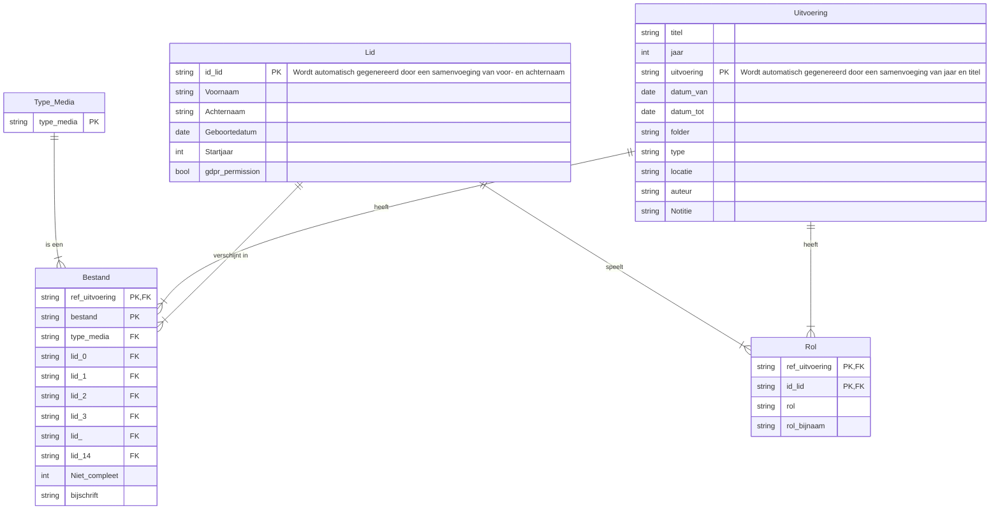

# Het Historisch Archief van Toneelvereniging KNA Hillegom

Dit project is heeft als doel een historisch archief beschikbaar te stellen voor de toneelvereniging waarmee gebruikers een eigen weg door de rijke geschiedenis van Kunst Na Arbeid (KNA) Hillegom kunnen afleggen.

## Het project van data voorzien

Wanneer je nieuwe informatie wil toevoegen aan de website krijg je te maken met drie onderdelen:

1. Media voor een uitvoering/evenement toevoegen
2. Informatie in de database zetten om informatie toe te voegen en media te koppelen
3. Een laadprogramma starten om

### Locatie data

Om data op de server beschikbaar te stellen kan je deze via [SFTP](https://en.wikipedia.org/wiki/SSH_File_Transfer_Protocol) op de website zetten. Als je een Windows gebruiker bent kan je hiervoor [WinSCP](https://winscp.net/eng/index.php) inzetten. Voor een Mac of Linux zijn er interne tools te gebruiken.

In de setup zoals die in dit project is gedefinieerd kan alle data geplaatst worden in de directory ```/data/kna_resources``` op de server.

### Media toevoegen

De directory ```/data/kna_resources``` heeft een directory voor elk jaar. Hier kun je media voor de evenementen/uitvoeringen in toevoegen door binnen een map van het jaar waar het evenement/uitvoering aan te maken. De jaar en naam van het evenement/uitvoering is van belang voor het koppelen van de media in de database.

### Informatie toevoegen en media koppelen

Je kunt data toevoegen door de Google Sheet [kna_database](https://docs.google.com/spreadsheets/d/13KDwR3IscHzJHt_mKWLaBtkP6HGC4ZtbhojuUbEjjlk/edit?gid=919083429#gid=919083429) aan te passen wanneer je toegang hebt tot de Google Drive van de vereniging.

In dit Google Sheets document staan een aantal tabbladen waarin verschillende informatie wordt geregistreerd:

* Type_Media -
* Leden -
* Uitvoering
* Bestand
* Rollen
* Uitvoering Locaties

#### Informatie




### Informatie in de database laden

Om data te laden in de database moet de data vanuit de Google Sheet op de server worden gezet waarna er een laadscript moet worden gestart.

Om de data uit Google Sheets op de server te zetten moet als eerst een Excel (xlsx) kopie worden gedownload. Deze gedownloade Excel file moet vervolgens in de directory ```/data/kna_resources``` op de server worden geplaatst.

Uitvoeren laadscript.


## Het project installeren

### Componenten

Het project bestaat uit een aantal componenten die de totale deployment stack vormen:

* De web-app die de user interface vormt, waarvan de source code te vinden is in de directory: ```app```
* De reverse proxy, [NGINX](https://docs.nginx.com/nginx/admin-guide/web-server/reverse-proxy/) die ervoor zorgt dat de web-app middels een [certbot](https://certbot.eff.org/), [Let’s Encrypt](https://letsencrypt.org/) certificaten een de webapp verbindt zodat de website via [HTTPS](https://en.wikipedia.org/wiki/HTTPS) beschikbaar is.
* Een database, [MariaDB](https://mariadb.org/) waar alle data in opgeslagen wordt die door de web-app voedt.
* Een domeinupdater die ervoor zorgt dat de domeinnaam naar het ip adres van de server wijst. In de huidige setup is hiervoor [Duck DNS](https://www.duckdns.org/) gebruikt met de daarvoor bedoelde [docker image](https://github.com/linuxserver/docker-duckdns)

### Voorwaarden

* Om het project te kunnen deployen is enige kennis van [Docker](https://www.docker.com/) en [Docker Compose](https://docs.docker.com/compose/) nodig.
* Deze installatie instructie gaat ervan uit dat u gaat deployen op een Linux server (huidige setup: [Ubuntu Server](https://ubuntu.com/download/server)).
* U heeft een github account nodig waarmee u de docker images kan downloaden en gebruiken. U kunt uw eigen docker images bouwen door ```app/build.sh``` aan te passen en uw eigen docker image naam en hosting aan te passen.
* U heeft een domeinnaam die u kunt verbinden aan de server. Het domein waar u het project gaat hosten moet aangepast worden in het bestand ```.env```.

