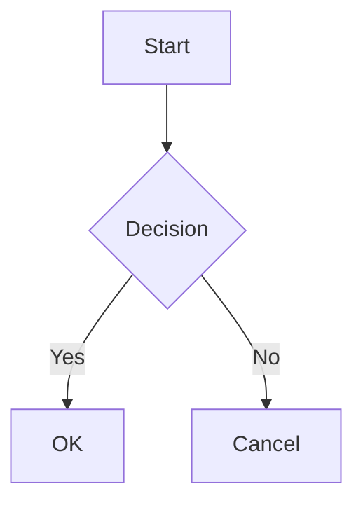

# KNA History Documentation

This directory contains the complete documentation for the KNA History application, built with MkDocs Material.

## Documentation Structure

```
docs/
├── index.md                          # Main documentation homepage
│
├── user-guide/                       # For end users and admins
│   ├── introduction.md              # Getting started
│   ├── navigation.md                # How to navigate the app
│   ├── searching.md                 # Search functionality
│   ├── viewing-media.md             # Viewing photos/videos
│   └── admin/                       # Admin-specific guides
│       ├── dashboard.md
│       ├── data-upload.md
│       ├── user-management.md
│       └── maintenance.md
│
├── developer-guide/                  # For developers
│   ├── architecture.md              # System architecture
│   ├── setup.md                     # Development environment setup
│   ├── configuration.md             # Configuration system
│   ├── database.md                  # Database schema
│   ├── api-reference.md             # Code API docs
│   ├── debugging/                   # Debugging guides
│   │   ├── quick-start.md
│   │   └── vscode-debugging-guide.md
│   └── contributing.md              # Contribution guidelines
│
└── deployment/                       # For DevOps/deployment
    ├── quick-start.md               # Quick deployment guide
    ├── production.md                # Production deployment
    ├── configuration.md             # Environment configuration
    ├── updates.md                   # Update procedures
    ├── backup.md                    # Backup strategies
    ├── monitoring.md                # Monitoring and health checks
    └── troubleshooting.md           # Common issues and solutions
```

## Building Documentation

### Prerequisites

```bash
pip install mkdocs-material
pip install mkdocs-glightbox
pip install mkdocstrings[python]
pip install mkdocs-git-revision-date-localized-plugin
pip install mkdocs-panzoom-plugin
```

Or with uv:

```bash
uv pip install mkdocs-material mkdocs-glightbox mkdocstrings[python] mkdocs-git-revision-date-localized-plugin mkdocs-panzoom-plugin
```

### Local Development

```bash
# Serve documentation locally with live reload
mkdocs serve

# Access at http://localhost:8000
```

### Build Static Site

```bash
# Build documentation to site/ directory
mkdocs build

# Build with strict mode (fail on warnings)
mkdocs build --strict
```

### Deploy to GitHub Pages

```bash
# Deploy to gh-pages branch
mkdocs gh-deploy

# With custom message
mkdocs gh-deploy --message "Update documentation"
```

## Documentation Features

### Material Theme Features

- **Dark/Light Mode** - Toggle between themes
- **Search** - Full-text search across all docs
- **Navigation** - Sticky tabs and breadcrumbs
- **Code Highlighting** - Syntax highlighting for code blocks
- **Admonitions** - Info boxes, warnings, tips
- **Tabs** - Organize content in tabs
- **Mermaid Diagrams** - Flow charts, sequence diagrams
- **Math** - LaTeX math expressions

### Custom Features

- **API Documentation** - Auto-generated from Python docstrings
- **Git Revision Dates** - Shows when each page was last updated
- **Image Zoom** - Click to zoom images
- **Offline Support** - Works without internet
- **Multi-language Code** - Show examples in different languages

## Writing Documentation

### Markdown Basics

```markdown
# H1 Heading
## H2 Heading
### H3 Heading

**Bold text**
*Italic text*
`Inline code`

- Bullet list
- Item 2

1. Numbered list
2. Item 2

[Link text](url)

```

### Admonitions

```markdown
!!! note
    This is a note

!!! tip "Custom Title"
    This is a tip with custom title

!!! warning
    This is a warning

!!! danger
    This is a danger alert
```

Types: `note`, `abstract`, `info`, `tip`, `success`, `question`, `warning`, `failure`, `danger`, `bug`, `example`, `quote`

### Code Blocks

````markdown
```python
def hello():
    print("Hello, world!")
```

```bash
# Run a command
python app.py
```

```javascript
const x = 10;
console.log(x);
```
````

### Tabs

```markdown
=== "Tab 1"
    Content for tab 1

=== "Tab 2"
    Content for tab 2
```

### Mermaid Diagrams

````markdown

````

### API Documentation

```markdown
::: kna_data.loader.KnaDataLoader
    options:
      show_source: true
      heading_level: 3
```

### Tables

```markdown
| Column 1 | Column 2 | Column 3 |
|----------|----------|----------|
| Data 1   | Data 2   | Data 3   |
| Data 4   | Data 5   | Data 6   |
```

## Documentation Status

### Completed

- ✅ Index page
- ✅ User guide introduction
- ✅ Navigation guide
- ✅ Developer architecture
- ✅ Development setup
- ✅ MkDocs configuration

### To Do

User Guide:
- ⏳ Searching guide
- ⏳ Viewing media guide
- ⏳ Admin dashboard
- ⏳ Data upload guide
- ⏳ User management
- ⏳ Maintenance guide

Developer Guide:
- ⏳ Configuration details
- ⏳ Database schema
- ⏳ API reference (auto-generated)
- ⏳ Contributing guide

Deployment:
- ⏳ Quick start
- ⏳ Production deployment
- ⏳ Configuration guide
- ⏳ Updates guide
- ⏳ Backup guide
- ⏳ Monitoring guide
- ⏳ Troubleshooting guide

## Contributing to Documentation

### Guidelines

1. **Use clear language** - Write for your audience (users vs developers)
2. **Include examples** - Show code snippets and screenshots
3. **Keep it updated** - Update docs when code changes
4. **Follow structure** - Use consistent heading levels
5. **Test locally** - Preview with `mkdocs serve` before committing

### File Naming

- Use lowercase
- Use hyphens for spaces: `user-management.md`
- Be descriptive: `vscode-debugging-guide.md`

### Front Matter

Add to top of each file (optional):

```markdown
---
title: Page Title
description: Page description for SEO
---
```

## Versioning

Documentation is versioned alongside code:

- **main** branch - Latest development docs
- **gh-pages** branch - Published docs
- Tags - Version-specific docs (v1.0.0, v1.1.0, etc.)

## Support

For documentation issues:

1. Check existing docs first
2. Review [MkDocs Material docs](https://squidfunk.github.io/mkdocs-material/)
3. Open issue on GitHub

## Resources

- [MkDocs](https://www.mkdocs.org/)
- [Material for MkDocs](https://squidfunk.github.io/mkdocs-material/)
- [Python Markdown](https://python-markdown.github.io/)
- [Mermaid Diagrams](https://mermaid-js.github.io/)
