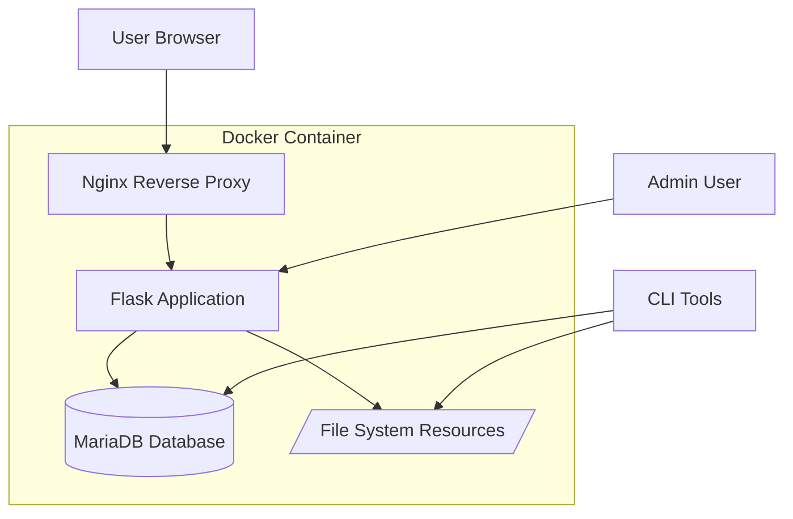
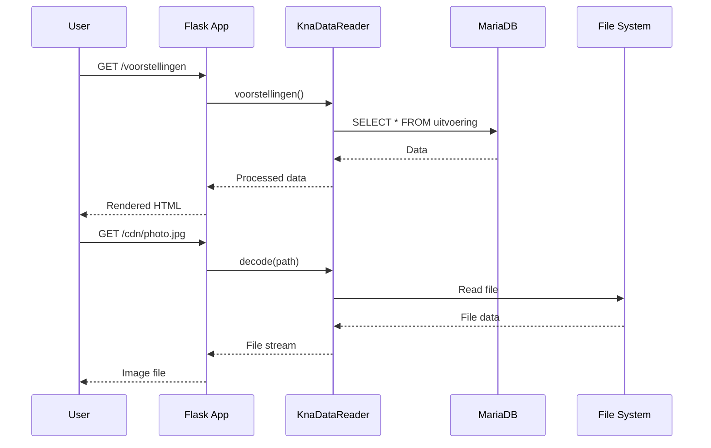
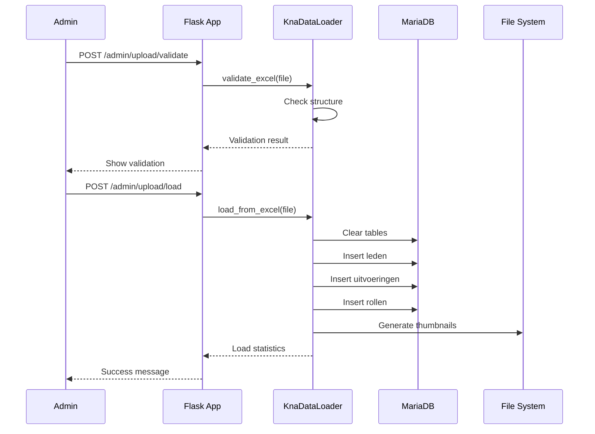
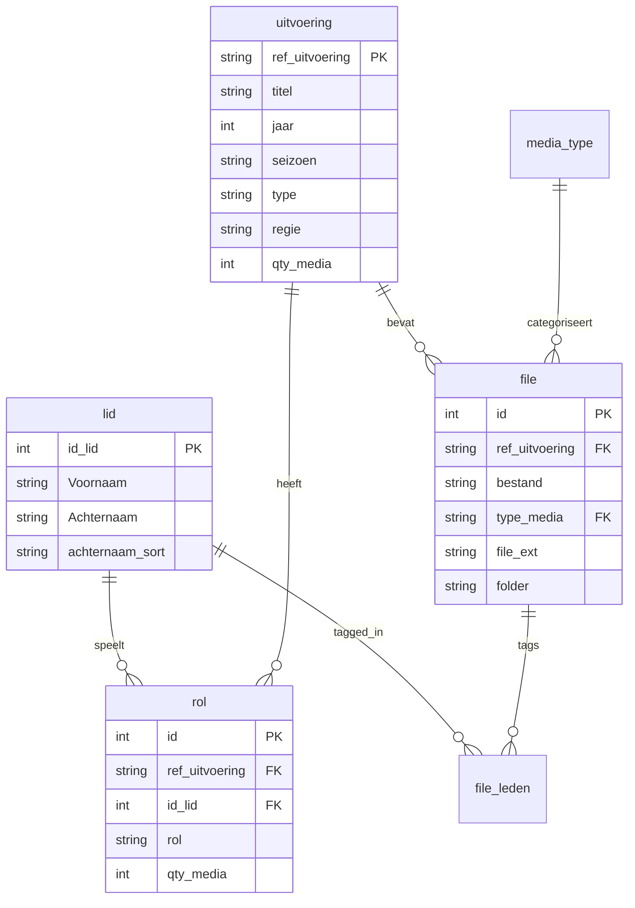
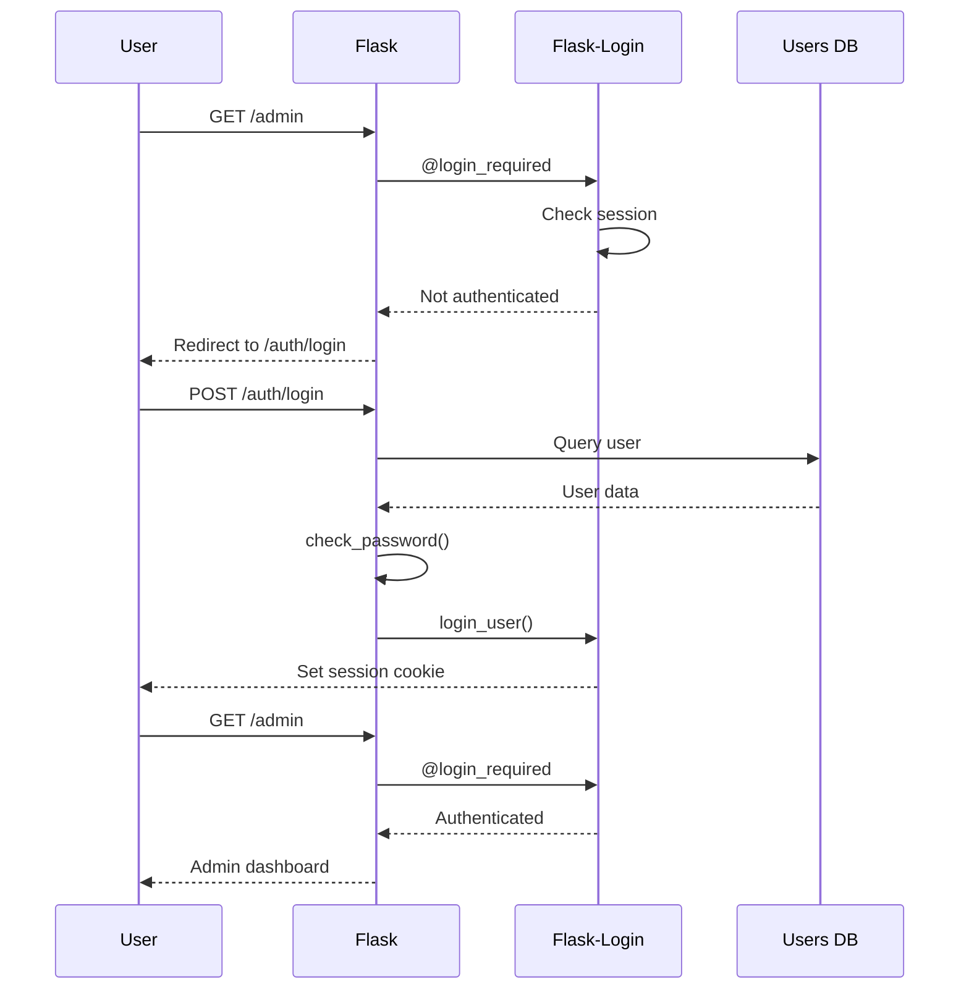

# Architecture

This document describes the technical architecture of the KNA History application.

## System Overview



## Technology Stack

### Backend

| Technology | Version | Purpose |
|------------|---------|---------|
| **Python** | 3.13 | Programming language |
| **Flask** | Latest | Web framework |
| **SQLAlchemy** | Latest | ORM for database |
| **Flask-Login** | Latest | User authentication |
| **Pandas** | Latest | Data processing |
| **Pillow** | Latest | Image processing |

### Frontend

| Technology | Purpose |
|------------|---------|
| **Jinja2** | Template engine |
| **Bootstrap** | CSS framework |
| **JavaScript** | Client-side interactivity |
| **Lightbox** | Media viewer |

### Database

| Technology | Version | Purpose |
|------------|---------|---------|
| **MariaDB** | 10.11.6 | Main database |
| **SQLite** | 3.x | Development/testing |

### Infrastructure

| Technology | Purpose |
|------------|---------|
| **Docker** | Containerization |
| **Nginx** | Reverse proxy & static files |
| **Gunicorn** | WSGI server |
| **Certbot** | SSL certificates |
| **DuckDNS** | Dynamic DNS |

## Application Structure

### Directory Layout

```
kna-history/
├── src/                          # Source code
│   ├── kna_data/                # Data package
│   │   ├── __init__.py
│   │   ├── config.py           # Configuration system
│   │   ├── reader.py           # Database reader
│   │   ├── loader.py           # Excel data loader
│   │   ├── models.py           # Database models
│   │   └── cli.py              # CLI interface
│   │
│   ├── blueprints/              # Flask blueprints
│   │   ├── admin.py            # Admin routes
│   │   └── auth.py             # Authentication routes
│   │
│   ├── templates/               # Jinja2 templates
│   │   ├── base.html
│   │   ├── admin/
│   │   └── ...
│   │
│   ├── static/                  # Static assets
│   │   ├── css/
│   │   ├── js/
│   │   └── images/
│   │
│   ├── app.py                   # Flask application factory
│   └── logging_kna.py           # Logging configuration
│
├── docs/                         # Documentation
├── deploy/                       # Deployment files
│   ├── nginx/
│   ├── certbot-auto/
│   └── *.sh                     # Deployment scripts
│
├── .github/                      # GitHub Actions
│   └── workflows/
│
├── Dockerfile                    # Container definition
├── docker-compose.yml           # Service orchestration
├── pyproject.toml               # Python dependencies
├── uv.lock                      # Locked dependencies
└── mkdocs.yml                   # Documentation config
```

## Architecture Patterns

### Application Factory Pattern

The Flask app uses the factory pattern for flexibility:

```python
def create_app(config_name=None):
    """Create and configure the Flask application"""
    app = Flask(__name__)
    
    # Load configuration
    config_obj = get_config(config_name)
    app.config.from_object(config_obj)
    
    # Initialize extensions
    db.init_app(app)
    login_manager.init_app(app)
    
    # Register blueprints
    app.register_blueprint(auth_bp)
    app.register_blueprint(admin_bp)
    
    return app
```

### Configuration Classes

Environment-specific configuration using class inheritance:

```python
class Config:
    """Base configuration"""
    SECRET_KEY = os.getenv("SECRET_KEY")
    # ...

class DevelopmentConfig(Config):
    """Development-specific settings"""
    DEBUG = True
    MARIADB_HOST = "127.0.0.1:3306"
    
class ProductionConfig(Config):
    """Production-specific settings"""
    DEBUG = False
    MARIADB_HOST = "mariadb"
```

### Blueprint Pattern

Modular organization using Flask blueprints:

```
Blueprints:
├── auth_bp (/auth)
│   ├── /login
│   └── /logout
│
└── admin_bp (/admin)
    ├── /dashboard
    ├── /upload
    ├── /users
    └── ...
```

## Data Flow

### Read Operations (User viewing content)



### Write Operations (Admin uploading data)



## Database Architecture

### Two-Database Design

The application uses **two separate databases**:

**1. KNA Data Database** (MariaDB)
- Historical theatre data
- Read/written by `KnaDataReader` and `KnaDataLoader`
- Connection via `config.mariadb_url`

Tables:
- `lid` - Members
- `uitvoering` - Performances
- `rol` - Roles
- `file` - Media files
- `file_leden` - File-member mapping
- `media_type` - Media types

**2. Users Database** (configurable)
- Flask-Login authentication
- Admin and viewer users
- Connection via `config.SQLALCHEMY_DATABASE_URI`

Tables:
- `users` - Application users

### Schema Diagram



See [Database Schema](database.md) for complete details.

## Component Interaction

### KnaDataReader

Reads data from the database for display:

```python
class KnaDataReader:
    def __init__(self, config):
        self.engine = config.get_engine()
        self.dir_resources = config.dir_resources
    
    def leden(self):
        """Get all members"""
        
    def voorstellingen(self):
        """Get all performances"""
        
    def medium(self, path):
        """Get media file details"""
```

### KnaDataLoader

Loads data from Excel into database:

```python
class KnaDataLoader:
    def __init__(self, config):
        self.engine = config.get_engine()
        
    def validate_excel(self, file_path):
        """Validate Excel structure"""
        
    def load_from_excel(self, file_path):
        """Load data from Excel"""
        # ETL process:
        # 1. Extract from Excel
        # 2. Transform data
        # 3. Load to database
```

### Authentication Flow



## File Storage

### Media Files Organization

```
/data/resources/
├── [voorstelling_folder]/
│   ├── photo1.jpg
│   ├── photo2.jpg
│   ├── video.mp4
│   └── thumbnails/
│       ├── photo1.jpg
│       └── photo2.jpg
└── ...
```

### Thumbnail Generation

Automatic thumbnail creation:

1. Walk through resources directory
2. Find images (.jpg, .png, .jpeg)
3. Create `thumbnails/` subdirectory
4. Generate 300x300 thumbnails
5. Save with same filename

## Logging

### Centralized Logging

```python
# logging_kna.py
logger = logging.getLogger("KNA")
logger.setLevel(logging.INFO)

# Usage throughout application
from logging_kna import logger

logger.info("Loading data from Excel")
logger.error("Failed to connect to database")
```

### Log Format

```
KNA 2026-02-06 22:00:00 INFO app.py:create_app Starting app with ProductionConfig
KNA 2026-02-06 22:00:01 INFO loader.py:load_from_excel Loading data from file.xlsx
KNA 2026-02-06 22:00:05 ERROR reader.py:leden Database connection failed
```

## Security Architecture

### Authentication

- **Flask-Login** session-based authentication
- **Werkzeug** password hashing (PBKDF2-SHA256)
- **Role-based access control** (admin vs viewer)

### Data Validation

- **Excel validation** before loading
- **SQL injection protection** via SQLAlchemy ORM
- **File upload validation** (type, size)
- **CSRF protection** via Flask forms

### Configuration Security

- **Environment variables** for secrets
- **No hardcoded credentials**
- **Validation before deployment**
- **.env files** excluded from git

## Performance Considerations

### Database

- **Connection pooling** via SQLAlchemy
- **Indexed columns** for fast queries
- **Batch operations** for data loading
- **Read replicas** possible for scaling

### Media Serving

- **Nginx static file serving** for performance
- **Thumbnail pre-generation** for faster loading
- **CDN endpoint** (`/cdn/`) for media
- **Lazy loading** of images

### Caching Strategy

Current: No caching implemented
Future possibilities:
- Redis for session storage
- Browser caching headers
- Database query caching
- Static asset versioning

## Scalability

### Horizontal Scaling

Possible with:
- **Load balancer** in front of multiple Flask instances
- **Shared database** (MariaDB)
- **Shared file storage** (NFS, S3)
- **Session storage** in Redis

### Vertical Scaling

- **Database** can handle large datasets
- **File system** limited by disk space
- **Memory** for Pandas operations
- **CPU** for image processing

## Monitoring & Health

### Health Check Endpoint

```python
@app.route("/health")
def health():
    try:
        with db_reader.engine.connect() as conn:
            conn.execute("SELECT 1")
        return {"status": "healthy", "database": "connected"}, 200
    except Exception as e:
        return {"status": "unhealthy", "error": str(e)}, 503
```

### Metrics

Available metrics:
- Application health
- Database connection status
- Disk usage
- Container resource usage

See [status.sh](../../deployment/updates.md#system-monitoring) for monitoring script.

## Next Steps

- [Development Setup](setup.md) - Set up local environment
- [Configuration](configuration.md) - Understand configuration system
- [Database Schema](database.md) - Detailed database documentation
- [API Reference](api-reference.md) - Code documentation
