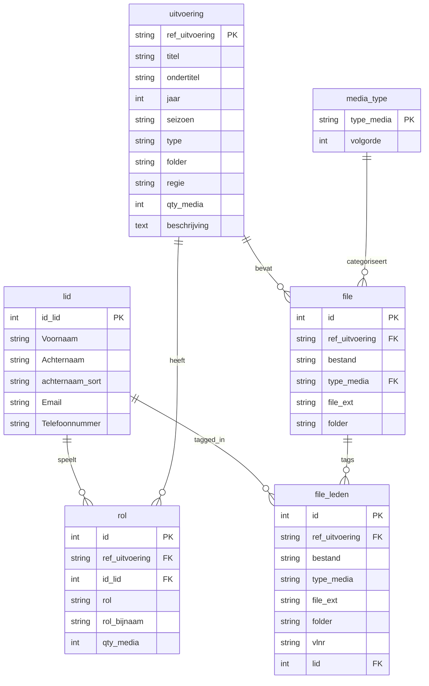

{ align=right width="90" }

# Database Schema

This document describes the complete database schema for the KNA History application.

## 🗺️ Overview

The application uses **two separate databases**:

1. **KNA Data Database** (MariaDB) - Historical theatre data
2. **Users Database** (MariaDB or SQLite) - Authentication and user management

## 🛢️ KNA Data Database

### Entity Relationship Diagram



### Table: `lid` (Members)

Stores information about all (current and former) members.

**Columns:**

| Column | Type | Constraints | Description |
|--------|------|-------------|-------------|
| `id_lid` | INT | PRIMARY KEY | Unique member ID |
| `Voornaam` | VARCHAR(100) | NOT NULL | First name |
| `Achternaam` | VARCHAR(100) | NOT NULL | Last name |
| `achternaam_sort` | VARCHAR(150) | | Sortable last name (handles Dutch prefixes) |
| `Email` | VARCHAR(255) | | Email address |
| `Telefoonnummer` | VARCHAR(20) | | Phone number |

**Indexes:**
```sql
CREATE INDEX idx_lid_achternaam ON lid(Achternaam);
CREATE INDEX idx_lid_sort ON lid(achternaam_sort);
```

**Sample Data:**
```sql
INSERT INTO lid VALUES
(1, 'Jan', 'de Vries', 'Vries, de', 'jan@email.nl', '0612345678'),
(2, 'Piet', 'Janssen', 'Janssen', 'piet@email.nl', '0687654321'),
(3, 'Marie', 'van der Berg', 'Berg, van der', NULL, NULL);
```

**Dutch Name Sorting:**

The `achternaam_sort` column handles Dutch naming conventions:

```python
# "de Vries" becomes "Vries, de"
# "van der Berg" becomes "Berg, van der"
# "Janssen" remains "Janssen"

tussenvoegsels = ["van der", "van den", "van de", "van", "de", "v.d."]
# Sorted under: B, J, V (not D)
```

### Table: `uitvoering` (Performances)

Stores all theatrical performances.

**Columns:**

| Column | Type | Constraints | Description |
|--------|------|-------------|-------------|
| `ref_uitvoering` | VARCHAR(200) | PRIMARY KEY | Performance reference (title) |
| `titel` | VARCHAR(200) | NOT NULL | Performance title |
| `ondertitel` | VARCHAR(255) | | Subtitle |
| `jaar` | INT | NOT NULL | Year of performance |
| `seizoen` | VARCHAR(20) | | Season (e.g., "2015-2016") |
| `type` | VARCHAR(50) | | Type (Uitvoering, Musical, etc.) |
| `folder` | VARCHAR(100) | | Media folder name |
| `regie` | VARCHAR(100) | | Director name |
| `qty_media` | INT | DEFAULT 0 | Number of media files |
| `beschrijving` | TEXT | | Description |

**Indexes:**
```sql
CREATE INDEX idx_uitvoering_jaar ON uitvoering(jaar);
CREATE INDEX idx_uitvoering_type ON uitvoering(type);
CREATE INDEX idx_uitvoering_folder ON uitvoering(folder);
```

**Performance Types:**
- `Uitvoering` - Regular play
- `Musical` - Musical
- `Jeugdtoneel` - Youth theatre
- `Eenakter` - One-act play
- `Anders` - Other

**Sample Data:**
```sql
INSERT INTO uitvoering VALUES
('Annie Get Your Gun', 'Annie Get Your Gun', 'Een Western Musical',
 2015, '2015-2016', 'Musical', 'annie_2015', 'Piet Janssen', 42,
 'Musical over Annie Oakley...');
```

### Table: `rol` (Roles)

Links members to performances with their roles.

**Columns:**

| Column | Type | Constraints | Description |
|--------|------|-------------|-------------|
| `id` | INT | PRIMARY KEY AUTO_INCREMENT | Unique role ID |
| `ref_uitvoering` | VARCHAR(200) | FOREIGN KEY | Performance reference |
| `id_lid` | INT | FOREIGN KEY | Member ID |
| `rol` | VARCHAR(200) | NOT NULL | Role name |
| `rol_bijnaam` | VARCHAR(100) | | Role nickname/type |
| `qty_media` | INT | DEFAULT 0 | Media count for this role |

**Foreign Keys:**
```sql
ALTER TABLE rol ADD FOREIGN KEY (ref_uitvoering)
    REFERENCES uitvoering(ref_uitvoering) ON DELETE CASCADE;

ALTER TABLE rol ADD FOREIGN KEY (id_lid)
    REFERENCES lid(id_lid) ON DELETE CASCADE;
```

**Indexes:**
```sql
CREATE INDEX idx_rol_uitvoering ON rol(ref_uitvoering);
CREATE INDEX idx_rol_lid ON rol(id_lid);
CREATE INDEX idx_rol_naam ON rol(rol);
```

**Special Roles:**
- `Regie` - Director
- `Techniek` - Technical crew
- `Decor` - Set design
- `Kostuum` - Costume design
- `Grime` - Makeup
- `Geluid` - Sound
- `Licht` - Lighting

**Sample Data:**
```sql
INSERT INTO rol (ref_uitvoering, id_lid, rol, rol_bijnaam, qty_media) VALUES
('Annie Get Your Gun', 1, 'Annie Oakley', 'Hoofdrol', 15),
('Annie Get Your Gun', 2, 'Regie', 'Regisseur', 0),
('Annie Get Your Gun', 3, 'Techniek', 'Decorbouw', 3);
```

### Table: `file` (Media Files)

Stores media file metadata.

**Columns:**

| Column | Type | Constraints | Description |
|--------|------|-------------|-------------|
| `id` | INT | PRIMARY KEY AUTO_INCREMENT | Unique file ID |
| `ref_uitvoering` | VARCHAR(200) | FOREIGN KEY | Performance reference |
| `bestand` | VARCHAR(255) | NOT NULL | Filename |
| `type_media` | VARCHAR(50) | FOREIGN KEY | Media type |
| `file_ext` | VARCHAR(10) | | File extension |
| `folder` | VARCHAR(100) | | Folder name |

**Foreign Keys:**
```sql
ALTER TABLE file ADD FOREIGN KEY (ref_uitvoering)
    REFERENCES uitvoering(ref_uitvoering) ON DELETE CASCADE;

ALTER TABLE file ADD FOREIGN KEY (type_media)
    REFERENCES media_type(type_media);
```

**Indexes:**
```sql
CREATE INDEX idx_file_uitvoering ON file(ref_uitvoering);
CREATE INDEX idx_file_type ON file(type_media);
CREATE INDEX idx_file_ext ON file(file_ext);
```

**Supported File Types:**
- Images: `.jpg`, `.jpeg`, `.png`, `.gif`, `.webp`
- Videos: `.mp4`, `.avi`, `.mov`, `.mkv`
- Documents: `.pdf`, `.doc`, `.docx`

**Sample Data:**
```sql
INSERT INTO file (ref_uitvoering, bestand, type_media, file_ext, folder) VALUES
('Annie Get Your Gun', 'scene1.jpg', 'Voorstellingsfoto', 'jpg', 'annie_2015'),
('Annie Get Your Gun', 'behind.jpg', 'Behind the scenes', 'jpg', 'annie_2015'),
('Annie Get Your Gun', 'video.mp4', 'Video', 'mp4', 'annie_2015');
```

### Table: `file_leden` (File-Member Mapping)

Maps which members appear in which media files.

**Columns:**

| Column | Type | Constraints | Description |
|--------|------|-------------|-------------|
| `id` | INT | PRIMARY KEY AUTO_INCREMENT | Unique mapping ID |
| `ref_uitvoering` | VARCHAR(200) | | Performance reference |
| `bestand` | VARCHAR(255) | | Filename |
| `type_media` | VARCHAR(50) | | Media type |
| `file_ext` | VARCHAR(10) | | File extension |
| `folder` | VARCHAR(100) | | Folder name |
| `vlnr` | VARCHAR(20) | | Column number (lid_1, lid_2, etc.) |
| `lid` | INT | FOREIGN KEY | Member ID |

**Foreign Key:**
```sql
ALTER TABLE file_leden ADD FOREIGN KEY (lid)
    REFERENCES lid(id_lid);
```

**Indexes:**
```sql
CREATE INDEX idx_file_leden_uitvoering ON file_leden(ref_uitvoering);
CREATE INDEX idx_file_leden_lid ON file_leden(lid);
CREATE INDEX idx_file_leden_bestand ON file_leden(bestand);
```

**Sample Data:**
```sql
INSERT INTO file_leden (ref_uitvoering, bestand, type_media, file_ext, folder, vlnr, lid) VALUES
('Annie Get Your Gun', 'scene1.jpg', 'Voorstellingsfoto', 'jpg', 'annie_2015', 'lid_1', 1),
('Annie Get Your Gun', 'scene1.jpg', 'Voorstellingsfoto', 'jpg', 'annie_2015', 'lid_2', 3);
-- This photo contains members 1 and 3
```

### Table: `media_type` (Media Categories)

Defines media type categories.

**Columns:**

| Column | Type | Constraints | Description |
|--------|------|-------------|-------------|
| `type_media` | VARCHAR(50) | PRIMARY KEY | Media type name |
| `volgorde` | INT | | Sort order |

**Sample Data:**
```sql
INSERT INTO media_type VALUES
('Voorstellingsfoto', 1),
('Behind the scenes', 2),
('Programmaboekje', 3),
('Poster', 4),
('Video', 5),
('Anders', 99);
```

## 👥 Users Database

### Table: `users` (Application Users)

Stores user accounts for authentication.

**Columns:**

| Column | Type | Constraints | Description |
|--------|------|-------------|-------------|
| `id` | INT | PRIMARY KEY AUTO_INCREMENT | User ID |
| `username` | VARCHAR(80) | UNIQUE, NOT NULL | Login username |
| `email` | VARCHAR(120) | UNIQUE, NOT NULL | Email address |
| `password_hash` | VARCHAR(255) | NOT NULL | Hashed password |
| `role` | VARCHAR(20) | NOT NULL, DEFAULT 'viewer' | User role |
| `active` | BOOLEAN | NOT NULL, DEFAULT TRUE | Account active |
| `created_at` | DATETIME | DEFAULT CURRENT_TIMESTAMP | Creation timestamp |

**Indexes:**
```sql
CREATE UNIQUE INDEX idx_user_username ON users(username);
CREATE UNIQUE INDEX idx_user_email ON users(email);
CREATE INDEX idx_user_role ON users(role);
CREATE INDEX idx_user_active ON users(active);
```

**User Roles:**
- `admin` - Full access to all features
- `viewer` - Read-only access

**Password Hashing:**
```python
from werkzeug.security import generate_password_hash, check_password_hash

# Hash password
password_hash = generate_password_hash("password123")
# pbkdf2:sha256:600000$...

# Verify password
is_valid = check_password_hash(password_hash, "password123")
```

**Sample Data:**
```sql
INSERT INTO users (username, email, password_hash, role, active) VALUES
('admin', 'admin@kna-hillegom.local', 'pbkdf2:sha256:...', 'admin', TRUE),
('j.devries', 'jan@email.nl', 'pbkdf2:sha256:...', 'viewer', TRUE);
```

## ❓ Database Queries

### Common Queries

#### Get All Active Members

```sql
SELECT id_lid, Voornaam, Achternaam, Email
FROM lid
ORDER BY achternaam_sort;
```

#### Get Performances by Year

```sql
SELECT ref_uitvoering, titel, jaar, type, regie, qty_media
FROM uitvoering
WHERE jaar BETWEEN 2010 AND 2020
ORDER BY jaar DESC;
```

#### Get Cast for Performance

```sql
SELECT
    l.Voornaam,
    l.Achternaam,
    r.rol,
    r.rol_bijnaam
FROM rol r
JOIN lid l ON r.id_lid = l.id_lid
WHERE r.ref_uitvoering = 'Annie Get Your Gun'
ORDER BY
    CASE
        WHEN r.rol = 'Regie' THEN 1
        WHEN r.rol_bijnaam = 'Hoofdrol' THEN 2
        ELSE 3
    END,
    l.achternaam_sort;
```

#### Get Media for Performance

```sql
SELECT
    f.bestand,
    f.type_media,
    f.file_ext,
    COUNT(fl.lid) as num_people
FROM file f
LEFT JOIN file_leden fl ON f.bestand = fl.bestand
WHERE f.ref_uitvoering = 'Annie Get Your Gun'
GROUP BY f.id
ORDER BY f.type_media, f.bestand;
```

#### Get Member's Performance History

```sql
SELECT
    u.jaar,
    u.titel,
    r.rol,
    r.rol_bijnaam
FROM rol r
JOIN uitvoering u ON r.ref_uitvoering = u.ref_uitvoering
WHERE r.id_lid = 1
ORDER BY u.jaar DESC;
```

#### Search Across All Content

```sql
-- Search members
SELECT 'member' as type, id_lid as id,
       CONCAT(Voornaam, ' ', Achternaam) as name
FROM lid
WHERE Voornaam LIKE '%Jan%' OR Achternaam LIKE '%Jan%'

UNION

-- Search performances
SELECT 'performance' as type, ref_uitvoering as id, titel as name
FROM uitvoering
WHERE titel LIKE '%Annie%'

UNION

-- Search roles
SELECT 'role' as type, id as id, rol as name
FROM rol
WHERE rol LIKE '%Annie%';
```

## ⏳ Data Loading Process

### ETL Pipeline

The data loading process follows Extract-Transform-Load pattern:


#### 1. Extract from Excel

```python
df_leden = pd.read_excel(file_path, sheet_name="Leden")
df_uitvoering = pd.read_excel(file_path, sheet_name="Uitvoering")
df_rollen = pd.read_excel(file_path, sheet_name="Rollen")
df_files = pd.read_excel(file_path, sheet_name="Bestand")
```

#### 2. Transform Data

**Sort Dutch Names:**
```python
# Handle Dutch prefixes
tussenvoegsels = ["van der", "van den", "van de", "van", "de", "v.d."]

for index, row in df_leden.iterrows():
    achternaam = row["Achternaam"]
    for prefix in tussenvoegsels:
        if achternaam.startswith(prefix + " "):
            # "de Vries" -> "Vries, de"
            naam = achternaam.replace(prefix + " ", "")
            df_leden.loc[index, "achternaam_sort"] = f"{naam}, {prefix}"
            break
```

**Enrich with Director:**
```python
# Extract director from roles
df_regie = df_rollen[df_rollen["rol"] == "Regie"]
df_regie = df_regie.groupby("ref_uitvoering")["id_lid"].first()

# Merge into performances
df_uitvoering = df_uitvoering.merge(df_regie, on="ref_uitvoering")
```

**Create File-Member Mapping:**
```python
# Melt lid_1, lid_2, ... columns into rows
df_file_leden = df_files.melt(
    id_vars=["ref_uitvoering", "bestand", "type_media"],
    value_vars=["lid_1", "lid_2", "lid_3", ...],
    var_name="vlnr",
    value_name="lid"
)
df_file_leden.dropna(subset=["lid"], inplace=True)
```

#### 3. Load to Database

```python
# Replace all data (truncate and insert)
df_leden.to_sql("lid", con=engine, if_exists="replace", index=False)
df_uitvoering.to_sql("uitvoering", con=engine, if_exists="replace", index=False)
df_rollen.to_sql("rol", con=engine, if_exists="replace", index=False)
df_files.to_sql("file", con=engine, if_exists="replace", index=False)
df_file_leden.to_sql("file_leden", con=engine, if_exists="replace", index=False)
```

## 🚧 Database Maintenance

### Optimization

```sql
-- Optimize all tables
OPTIMIZE TABLE lid;
OPTIMIZE TABLE uitvoering;
OPTIMIZE TABLE rol;
OPTIMIZE TABLE file;
OPTIMIZE TABLE file_leden;
OPTIMIZE TABLE media_type;
```

### Integrity Checks

```sql
-- Check for orphaned roles (member doesn't exist)
SELECT r.*
FROM rol r
LEFT JOIN lid l ON r.id_lid = l.id_lid
WHERE l.id_lid IS NULL;

-- Check for orphaned files (performance doesn't exist)
SELECT f.*
FROM file f
LEFT JOIN uitvoering u ON f.ref_uitvoering = u.ref_uitvoering
WHERE u.ref_uitvoering IS NULL;

-- Check for missing media files
SELECT f.folder, f.bestand
FROM file f
WHERE NOT EXISTS (
    SELECT 1 FROM file_leden fl
    WHERE fl.bestand = f.bestand
);
```

### Statistics

```sql
-- Table sizes
SELECT
    table_name,
    ROUND(((data_length + index_length) / 1024 / 1024), 2) AS 'Size (MB)',
    table_rows AS 'Rows'
FROM information_schema.TABLES
WHERE table_schema = 'kna'
ORDER BY (data_length + index_length) DESC;

-- Media statistics
SELECT
    type_media,
    COUNT(*) as aantal,
    COUNT(DISTINCT ref_uitvoering) as voorstellingen
FROM file
GROUP BY type_media
ORDER BY volgorde;
```

## 💾 Backup & Restore

### Backup

```bash
# Full database backup
mysqldump -u root -p kna > kna_backup_$(date +%Y%m%d).sql

# Compress
gzip kna_backup_*.sql

# Specific tables
mysqldump -u root -p kna lid uitvoering > members_and_shows.sql
```

### Restore

```bash
# Decompress
gunzip kna_backup_20260207.sql.gz

# Restore
mysql -u root -p kna < kna_backup_20260207.sql

# Or via Docker
gunzip < kna_backup.sql.gz | \
  docker exec -i mariadb mysql -u root -p kna
```

## 📈 Performance Considerations

### Indexes

All foreign keys have indexes for fast joins:
- `idx_rol_uitvoering` - Fast role lookups by performance
- `idx_rol_lid` - Fast role lookups by member
- `idx_file_uitvoering` - Fast media lookups by performance
- `idx_file_leden_lid` - Fast media lookups by member

### Query Optimization

**Use EXPLAIN to analyze:**
```sql
EXPLAIN SELECT * FROM rol
WHERE ref_uitvoering = 'Annie Get Your Gun';
```

**Add covering indexes when needed:**
```sql
CREATE INDEX idx_rol_cover ON rol(ref_uitvoering, id_lid, rol);
```

### Connection Pooling

```python
engine = create_engine(
    config.mariadb_url,
    pool_size=10,          # Max 10 connections
    max_overflow=20,       # Allow 20 overflow
    pool_pre_ping=True,    # Verify connections
    pool_recycle=3600      # Recycle after 1 hour
)
```

## ➡️ Next Steps

- [Understand configuration](configuration.md)
- [Review architecture](architecture.md)
- [Set up development](setup.md)
- [Read API reference](api-reference.md)
