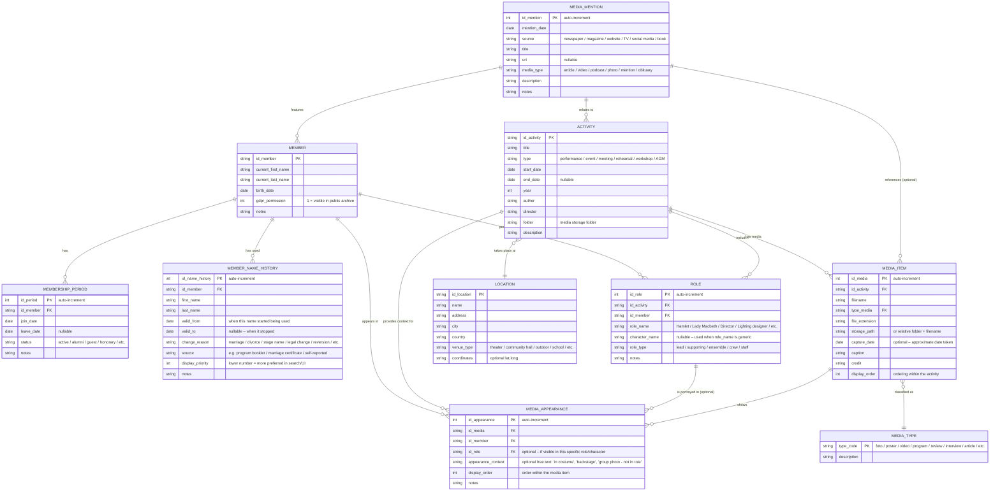

# New Database design

```mermaid
erDiagram
    MEMBER ||--o{ MEMBERSHIP_PERIOD     : "has"
    MEMBER ||--o{ MEMBER_NAME_HISTORY   : "has used"
    MEMBER ||--o{ ROLE                  : "performs"
    MEMBER ||--o{ MEDIA_APPEARANCE      : "appears in"

    ACTIVITY ||--o{ ROLE                : "includes"
    ACTIVITY ||--o{ MEDIA_ITEM          : "has media"
    ACTIVITY ||--o{ MEDIA_APPEARANCE    : "provides context for"
    ACTIVITY }o--|| LOCATION            : "takes place at"

    ROLE ||--o{ MEDIA_APPEARANCE        : "is portrayed in (optional)"

    MEDIA_ITEM ||--o{ MEDIA_APPEARANCE  : "shows"
    MEDIA_ITEM }o--|| MEDIA_TYPE        : "classified as"

    MEDIA_MENTION ||--o{ MEMBER         : "features"
    MEDIA_MENTION ||--o{ ACTIVITY       : "relates to"
    MEDIA_MENTION ||--o{ MEDIA_ITEM     : "references (optional)"

    %% ──────────────────────────────────────────────────────────────
    %% Entities
    %% ──────────────────────────────────────────────────────────────

    MEMBER {
        string id_member                    PK
        string current_first_name
        string current_last_name
        date   birth_date
        int    gdpr_permission              "1 = visible in public archive"
        string notes
    }

    MEMBER_NAME_HISTORY {
        int    id_name_history              PK "auto-increment"
        string id_member                    FK
        string first_name
        string last_name
        date   valid_from                   "when this name started being used"
        date   valid_to                     "nullable – when it stopped"
        string change_reason                "marriage / divorce / stage name / legal change / reversion / etc."
        string source                       "e.g. program booklet / marriage certificate / self-reported"
        int    display_priority             "lower number = more preferred in search/UI"
        string notes
    }

    MEMBERSHIP_PERIOD {
        int    id_period                    PK "auto-increment"
        string id_member                    FK
        date   join_date
        date   leave_date                   "nullable"
        string status                       "active / alumni / guest / honorary / etc."
        string notes
    }

    ACTIVITY {
        string id_activity                  PK
        string title
        string type                         "performance / event / meeting / rehearsal / workshop / AGM"
        date   start_date
        date   end_date                     "nullable"
        int    year
        string author
        string director
        string folder                       "media storage folder"
        string description
    }

    LOCATION {
        string id_location                  PK
        string name
        string address
        string city
        string country
        string venue_type                   "theater / community hall / outdoor / school / etc."
        string coordinates                  "optional lat,long"
    }

    ROLE {
        int    id_role                      PK "auto-increment"
        string id_activity                  FK
        string id_member                    FK
        string role_name                    "Hamlet / Lady Macbeth / Director / Lighting designer / etc."
        string character_name               "nullable – used when role_name is generic"
        string role_type                    "lead / supporting / ensemble / crew / staff"
        string notes
    }

    MEDIA_ITEM {
        int    id_media                     PK "auto-increment"
        string id_activity                  FK
        string filename
        string type_media                   FK
        string file_extension
        string storage_path                 "or relative folder + filename"
        date   capture_date                 "optional – approximate date taken"
        string caption
        string credit
        int    display_order                "ordering within the activity"
    }

    MEDIA_APPEARANCE {
        int    id_appearance                PK "auto-increment"
        string id_media                     FK
        string id_member                    FK
        string id_role                      FK "optional – if visible in this specific role/character"
        string appearance_context           "optional free text: 'in costume', 'backstage', 'group photo - not in role'"
        int    display_order                "order within the media item"
        string notes
    }

    MEDIA_TYPE {
        string type_code                    PK "foto / poster / video / program / review / interview / article / etc."
        string description
    }

    MEDIA_MENTION {
        int    id_mention                   PK "auto-increment"
        date   mention_date
        string source                       "newspaper / magazine / website / TV / social media / book"
        string title
        string url                          "nullable"
        string media_type                   "article / video / podcast / photo / mention / obituary"
        string description
        string notes
    }
```