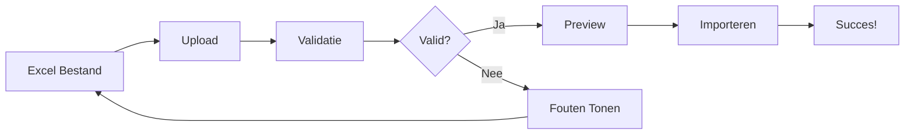

{ align=right width="90" }

# Data Uploaden

Deze handleiding legt uit hoe je nieuwe data uploadt naar het KNA Historie archief via Excel bestanden.

## 🧭 Overzicht Upload Proces



Het upload proces bestaat uit drie stappen:
1. **Upload** - Bestand selecteren en uploaden
2. **Validatie** - Automatische controle op fouten
3. **Import** - Data daadwerkelijk in database laden

## 📊 Excel Bestand Voorbereiden

### Vereiste Structuur

Het Excel bestand moet de volgende sheets bevatten:

| Sheet Naam | Verplicht | Beschrijving |
|------------|-----------|--------------|
| **Leden** | ✅ Ja | Alle (oud-)leden |
| **Uitvoering** | ✅ Ja | Voorstellingen |
| **Rollen** | ✅ Ja | Wie speelde wat |
| **Bestand** | ✅ Ja | Media bestanden |
| **Type_Media** | ✅ Ja | Media categorieën |

### Sheet: Leden

Kolommen voor ledengegevens:

| Kolom | Type | Verplicht | Voorbeeld |
|-------|------|-----------|-----------|
| `id_lid` | Nummer | ✅ | 1, 2, 3 |
| `Voornaam` | Tekst | ✅ | Jan |
| `Achternaam` | Tekst | ✅ | de Vries |
| `Email` | Tekst | ❌ | jan@email.nl |
| `Telefoonnummer` | Tekst | ❌ | 0612345678 |

!!! tip "Nederlandse Achternamen"
    Tussenvoegsels (van, de, van der) worden automatisch correct gesorteerd.
    Gebruik: "de Vries", "van der Berg"

### Sheet: Uitvoering

Kolommen voor voorstellingen:

| Kolom | Type | Verplicht | Voorbeeld |
|-------|------|-----------|-----------|
| `uitvoering` | Tekst | ✅ | Annie Get Your Gun |
| `jaar` | Nummer | ✅ | 2015 |
| `seizoen` | Tekst | ✅ | 2015-2016 |
| `type` | Tekst | ✅ | Musical |
| `folder` | Tekst | ✅ | annie_2015 |
| `ondertitel` | Tekst | ❌ | Een Western Musical |
| `beschrijving` | Tekst | ❌ | Over Annie Oakley... |

**Type opties:**
- Uitvoering
- Musical
- Jeugdtoneel
- Eenakter
- Anders

### Sheet: Rollen

Kolommen voor cast/crew:

| Kolom | Type | Verplicht | Voorbeeld |
|-------|------|-----------|-----------|
| `ref_uitvoering` | Tekst | ✅ | Annie Get Your Gun |
| `id_lid` | Nummer | ✅ | 42 |
| `rol` | Tekst | ✅ | Annie Oakley |
| `rol_bijnaam` | Tekst | ❌ | Hoofdrol |

**Speciale rollen:**
- `Regie` - Regisseur
- `Techniek` - Technische crew
- `Decor` - Decorontwerp
- `Kostuum` - Kostuumontwerp

### Sheet: Bestand

Kolommen voor media:

| Kolom | Type | Verplicht | Voorbeeld |
|-------|------|-----------|-----------|
| `ref_uitvoering` | Tekst | ✅ | Annie Get Your Gun |
| `bestand` | Tekst | ✅ | foto001.jpg |
| `type_media` | Tekst | ✅ | Voorstellingsfoto |
| `lid_1` t/m `lid_10` | Nummer | ❌ | 42, 15, 23 |

!!! note "Media Bestanden"
    De daadwerkelijke foto/video bestanden moeten in de juiste map staan.
    Zie [Media Beheer](#media-bestanden-koppelen).

### Sheet: Type_Media

Media categorieën:

| Kolom | Type | Verplicht | Voorbeeld |
|-------|------|-----------|-----------|
| `type_media` | Tekst | ✅ | Voorstellingsfoto |
| `volgorde` | Nummer | ✅ | 1 |

**Standaard types:**
1. Voorstellingsfoto
2. Behind the scenes
3. Programmaboekje
4. Poster
5. Video
6. Anders

## ⬆️ Upload Stap voor Stap

### Stap 1: Navigeer naar Upload

1. Log in als admin
2. Ga naar **Admin Dashboard**
3. Klik op **📤 Upload Data**

### Stap 2: Bestand Selecteren

1. Klik op **Bestand Kiezen**
2. Selecteer je Excel bestand
3. Controleer bestandsnaam en grootte

**Limieten:**
- Max grootte: **50 MB**
- Toegestane formaten: `.xlsx`, `.xls`

!!! warning "Grote Bestanden"
    Bestanden >50MB moeten via CLI worden geüpload.
    Zie [CLI Upload](#cli-upload).

### Stap 3: Valideren

Klik op **Valideren**. Het systeem controleert:

**Structuur**
- ✅ Alle vereiste sheets aanwezig
- ✅ Kolommen correct benoemd
- ✅ Data types kloppen

**Integriteit**
- ✅ id_lid bestaat in Leden sheet
- ✅ ref_uitvoering bestaat in Uitvoering sheet
- ✅ Geen dubbele IDs
- ✅ Geen lege verplichte velden

**Validatie Resultaat:**

=== "✅ Succesvol"
    ```
    ✅ Validatie GESLAAGD

    Sheet informatie:
      Leden          : 234 rijen
      Uitvoering     :  89 rijen
      Rollen         : 1.456 rijen
      Bestand        : 3.421 rijen
      Type_Media     :   6 rijen
    ```

    Je kunt nu doorgaan naar importeren.

=== "❌ Mislukt"
    ```
    ❌ Validatie GEFAALD

    Fouten:
      - Sheet 'Leden' mist kolom 'Achternaam'
      - Rij 42: id_lid '999' niet gevonden in Leden
      - Uitvoering 'Faust': geen folder opgegeven
    ```

    Corrigeer de fouten en upload opnieuw.

=== "⚠️ Waarschuwingen"
    ```
    ✅ Validatie GESLAAGD (met waarschuwingen)

    Waarschuwingen:
      - 12 leden zonder email adres
      - 3 voorstellingen zonder beschrijving
      - 45 bestanden zonder getagde personen
    ```

    Je kunt importeren, maar bekijk waarschuwingen.

### Stap 4: Preview

Na succesvolle validatie zie je een preview:

**Samenvatting**
- Aantal nieuwe leden
- Aantal nieuwe voorstellingen
- Aantal nieuwe media bestanden
- Totaal aantal rollen

**Wijzigingen**
- Wat wordt **toegevoegd**
- Wat wordt **gewijzigd**
- Wat wordt **verwijderd**

!!! danger "Huidige Data wordt Overschreven"
    Let op: De import vervangt ALLE huidige data!
    Maak eerst een backup via Dashboard → Backup.

### Stap 5: Importeren

Als je tevreden bent met de preview:

1. Klik **Importeren**
2. Bevestig de actie
3. Wacht terwijl data wordt geladen

**Import Voortgang:**

```
⏳ Data wordt geladen...

✅ Leden geladen       (234/234)
✅ Uitvoeringen geladen (89/89)
✅ Rollen geladen      (1456/1456)
✅ Bestanden geladen   (3421/3421)
🖼️ Thumbnails genereren...
✅ Thumbnails gegenereerd (3298/3421)

✅ Import succesvol voltooid!
```

### Stap 6: Verifiëren

Controleer of alles correct is geïmporteerd:

1. Ga naar **Dashboard**
2. Check statistieken
3. Blader door voorstellingen
4. Test zoekfunctie
5. Bekijk random foto's

## 🔗 Media Bestanden Koppelen

### Bestandsstructuur

Media bestanden moeten in de juiste mappenstructuur staan:

```
/data/resources/
├── annie_2015/
│   ├── foto001.jpg
│   ├── foto002.jpg
│   ├── video001.mp4
│   └── programma.pdf
│
├── faust_2018/
│   ├── scene1.jpg
│   ├── scene2.jpg
│   └── cast.jpg
│
└── ...
```

**Regels:**
- Map naam moet overeenkomen met `folder` kolom in Excel
- Bestandsnamen moeten overeenkomen met `bestand` kolom
- Ondersteunde formaten: `.jpg`, `.jpeg`, `.png`, `.mp4`, `.pdf`

### Bestanden Uploaden

**Via FTP/SFTP:**
1. Verbind met server
2. Navigeer naar `/data/resources/`
3. Upload mappen met bestanden
4. Controleer permissies (755 voor mappen, 644 voor bestanden)

**Via SSH:**
```bash
# Upload map
scp -r annie_2015/ user@server:/data/resources/

# Of met rsync
rsync -av annie_2015/ user@server:/data/resources/annie_2015/
```

### Thumbnails Genereren

Na het uploaden van media:

1. Ga naar **Admin** → **Onderhoud**
2. Klik **Thumbnails Regenereren**
3. Wacht tot proces compleet

[Meer over thumbnails →](maintenance.md#thumbnails)

## 💻 CLI Upload

Voor grote bestanden of geautomatiseerde uploads:

### Valideren via CLI

```bash
# Valideer bestand
python -m kna_data.cli validate /pad/naar/bestand.xlsx

# Met development database
python -m kna_data.cli validate --dev /pad/naar/bestand.xlsx
```

### Importeren via CLI

```bash
# Upload naar productie
python -m kna_data.cli load /pad/naar/bestand.xlsx

# Upload naar development
python -m kna_data.cli load --dev /pad/naar/bestand.xlsx

# Skip validatie (gebruik met voorzichtigheid!)
python -m kna_data.cli load --skip-validation /pad/naar/bestand.xlsx
```

### Output Voorbeeld

```
KNA 2026-02-07 10:00:00 INFO Loading data from: kna_database.xlsx
KNA 2026-02-07 10:00:00 INFO Using environment: production
KNA 2026-02-07 10:00:01 INFO Validating Excel file...
KNA 2026-02-07 10:00:02 INFO ✅ Validation PASSED
KNA 2026-02-07 10:00:02 INFO Loading leden (members)...
KNA 2026-02-07 10:00:03 INFO Loaded 234 members
...
==================================================
Load completed successfully!
==================================================
lid                 :    234 rows
uitvoering          :     89 rows
rol                 :   1456 rows
file                :   3421 rows
thumbnails          :   3298 rows
```

## ⚠️ Veelvoorkomende Fouten

### Validatie Fouten

#### "Missing required sheet: Leden"

**Oorzaak:** Leden sheet ontbreekt of verkeerd gespeld

**Oplossing:**
- Controleer sheet naam (exact "Leden")
- Let op hoofdletters
- Geen spaties voor/na naam

#### "Leden sheet missing column: Achternaam"

**Oorzaak:** Vereiste kolom ontbreekt

**Oplossing:**
- Voeg kolom `Achternaam` toe
- Controleer spelling (exact match nodig)
- Controleer of kolom niet leeg is

#### "Rij 42: id_lid '999' not found in Leden"

**Oorzaak:** Rol verwijst naar niet-bestaand lid

**Oplossing:**
- Voeg lid 999 toe aan Leden sheet
- Corrigeer id_lid in Rollen sheet
- Check voor typfouten in IDs

### Import Fouten

#### "Database connection failed"

**Oorzaak:** Kan geen verbinding maken met database

**Oplossing:**
```bash
# Check database status
docker compose ps mariadb

# Restart database
docker compose restart mariadb
```

#### "Permission denied on /data/resources"

**Oorzaak:** Geen schrijfrechten op resources map

**Oplossing:**
```bash
# Fix permissies
sudo chown -R 1000:1000 /data/resources
sudo chmod -R 755 /data/resources
```

#### "File not found: foto001.jpg"

**Oorzaak:** Media bestand niet op server

**Oplossing:**
- Upload ontbrekende bestanden
- Controleer bestandsnamen (hoofdlettergevoelig!)
- Check map structuur

## 📐 Best Practices

### Voor Upload

!!! tip "Checklist Voor Upload"
    - ☑️ Maak backup van huidige data
    - ☑️ Test Excel bestand eerst lokaal
    - ☑️ Valideer altijd voor import
    - ☑️ Upload media bestanden eerst
    - ☑️ Check schijfruimte
    - ☑️ Plan upload buiten piekuren

### Excel Bestand

**Kwaliteit:**
- Gebruik consistent formaat
- Geen speciale tekens in bestandsnamen
- Datums in juiste formaat (YYYY-MM-DD)
- Getallen zonder decimalen voor IDs

**Organisatie:**
- Logische volgorde in sheets
- Duidelijke kolom headers
- Geen lege rijen tussen data
- Geen verborgen kolommen met data

### Na Upload

**Verificatie:**
- Check statistieken in dashboard
- Test random voorstellingen
- Verifieer media links werken
- Controleer zoekfunctie

**Communicatie:**
- Informeer gebruikers over wijzigingen
- Document wat je hebt geüpload
- Bewaar backup voor 30 dagen

## ⏪ Rollback

Als er iets mis gaat:

### Via Dashboard

1. Ga naar **Onderhoud** → **Restore**
2. Selecteer laatste backup
3. Kies wat te herstellen
4. Bevestig restore

### Via CLI

```bash
# Stop applicatie
docker compose down kna-historie

# Restore database
gunzip < backup_20260207.sql.gz | \
  docker exec -i mariadb mysql -u root -p kna

# Start applicatie
docker compose up -d kna-historie
```

[Meer over backup & restore →](maintenance.md#backup-restore)

## 🧠 Geavanceerd

### Incrementele Updates

Voor kleine wijzigingen:

1. Export huidige data naar Excel
2. Wijzig alleen wat nodig is
3. Upload volledig bestand

!!! warning "Geen Merge Functie"
    Het systeem doet geen incrementele merge.
    Elk upload vervangt ALLE data.

### Batch Processing

Voor zeer grote datasets:

```bash
# Split Excel in kleinere delen
# Upload elk deel apart via CLI
python -m kna_data.cli load deel1.xlsx
python -m kna_data.cli load deel2.xlsx
```

### Geautomatiseerde Uploads

Voor regelmatige updates:

```bash
#!/bin/bash
# upload.sh

# Valideer
python -m kna_data.cli validate $1

# Als valid, upload
if [ $? -eq 0 ]; then
    python -m kna_data.cli load $1
fi
```

Gebruik met cron:
```cron
# Elke zondag om 02:00
0 2 * * 0 /path/to/upload.sh /path/to/weekly_export.xlsx
```

## ➡️ Volgende Stappen

- [Leer gebruikers beheren](user-management.md)
- [Onderhoud taken uitvoeren](maintenance.md)
- [Terug naar dashboard](dashboard.md)
